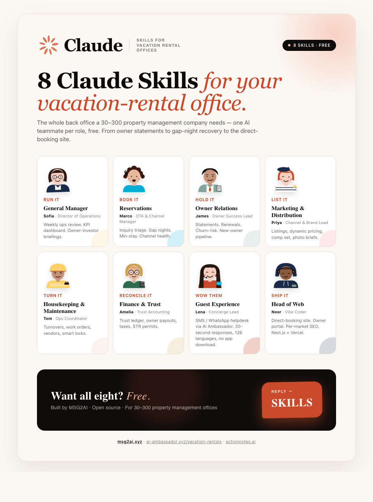

# Vacation Rental Team Skills for Claude

**8 free Claude skills — one for every seat in your vacation-rental property management office, plus a vibe coder to ship the direct-booking site.**

Built by [MSG2AI](https://msg2ai.xyz) · AI Ambassador for vacation-rental guests · ActionNotes for owner reviews

<p align="center">
  <a href="./docs/campaign-visual.html">
    
  </a>
  <br/>
  <em>The 8 AI teammates · <a href="./docs/campaign-visual.html">view the animated visual</a> · <a href="https://vacationrental-team-skills-website.vercel.app">non-technical landing page</a></em>
</p>

---

## What this is

Every vacation-rental management office has the same 8 roles. Most offices have 3–5 people trying to cover all of them across 30–300 properties. These Claude skills give each role its own AI counterpart — trained on what that role actually does in this industry, wired into the connectors you already use (channel manager, Gmail, Google Drive, Stripe, your CRM). Plus an 8th skill — a **Vibe Coder** — that ships the direct-booking website to production with Next.js, Vercel, and GitHub.

Install one skill or all eight. Each is self-contained.

> **Looking for the non-technical overview?** See the [landing page](https://vacationrental-team-skills-website.vercel.app) — examples, scenarios, and value for property management offices without any setup talk.

---

## The 8 Skills

| Skill | Role | Persona | Key Capabilities |
|---|---|---|---|
| [`vacationrental-general-manager`](./vacationrental-general-manager/) | General Manager / Director of Operations | **Sofia** | Weekly ops review, KPI dashboard, owner-investor briefings, risk register, growth pipeline |
| [`vacationrental-bookings-reservations`](./vacationrental-bookings-reservations/) | Reservations Manager | **Marco** | OTA inquiry triage, double-booking prevention, gap-night recovery, min-stay & instant-book strategy, channel health |
| [`vacationrental-owner-relations`](./vacationrental-owner-relations/) | Owner Relations Lead | **James** | Monthly owner statements, mid-month updates, quarterly reviews, renewal pitches, churn-risk detection, new-owner onboarding |
| [`vacationrental-marketing-distribution`](./vacationrental-marketing-distribution/) | Marketing & Distribution | **Priya** | Listing optimization, dynamic pricing, comp-set analysis, photography briefs, direct-booking campaigns, brand & voice |
| [`vacationrental-housekeeping-maintenance`](./vacationrental-housekeeping-maintenance/) | Housekeeping & Maintenance Coordinator | **Tom** | Daily turnover scheduling, inspections, work-order dispatch, vendor network, linen & supply, preventive maintenance, smart locks |
| [`vacationrental-finance-trust`](./vacationrental-finance-trust/) | Finance & Trust Accounting | **Amelia** | Trust account reconciliation, monthly owner payouts, OTA payout reconciliation, occupancy/lodging/sales tax filings, STR permits, per-property P&L |
| [`vacationrental-guest-experience`](./vacationrental-guest-experience/) | Guest Experience Lead | **Lena** | Pre-arrival sequence, AI Ambassador config, in-stay issue handling, upsells, local concierge, review capture, NPS — powered by [AI Ambassador for Vacation Rentals](https://ai-ambassador.xyz/vacation-rentals) |
| [`vacationrental-vibe-coder`](./vacationrental-vibe-coder/) | Vibe Coder / Web Builder | **Noor** | Direct-booking site, per-property landing pages, owner lead-capture, owner portal, per-market SEO pages — ships to Vercel via Next.js + GitHub |

---

## First step for every skill: a shared Knowledge Base

Every skill is designed to read from — and write to — one **shared Knowledge Base** for your portfolio. This is the very first thing to set up. It can live anywhere your team already keeps documents:

- **Google Drive** folder (most common)
- **Dropbox** folder
- **OneDrive / SharePoint / Box** folder
- **Notion** workspace
- Local folder synced to any of the above

The skills expect this canonical structure (the General Manager skill will create it for you if you don't have one):

```
portfolio-knowledge-base/
├── 01-portfolio-brief/        ← company brief, # properties, markets, brand
├── 02-brand-and-voice/        ← logos, colors, photo style, tone of voice
├── 03-properties/             ← per-property folders (one per unit)
├── 04-owners/                 ← owner contracts, statements, comms log
├── 05-channels/               ← Airbnb / VRBO / Booking.com / direct exports
├── 06-housekeeping-maintenance/   ← SOPs, vendor list, work orders, inspections
├── 07-finance-trust/          ← trust ledger, payouts, taxes, P&L
├── 08-guests/                 ← guests, reviews, NPS, helpdesk transcripts
├── 09-meeting-notes/          ← team notes, decisions, owner meetings
├── 10-msg2ai-export/          ← generated JSON for hello.msg2ai.xyz
└── 11-web/                    ← direct-booking site repos, deploys
```

### Bootstrap from your Airbnb host profile or direct-booking site (Firecrawl)

If you already have an Airbnb host profile, a VRBO landlord page, or a direct-booking site, you don't need to fill the Knowledge Base by hand. The skills will use **Firecrawl** to crawl your channels and extract structured information — property list, headline copy, amenities, review counts, ADR signals — and seed `01-portfolio-brief/from-website.md` and per-property scaffolds in `03-properties/`.

---

## Prerequisites

Before installing, you need **one** of the following:

| Method | What you need | Best for |
|---|---|---|
| npx (Option 1) | Node.js 18+ | Quickest install — one command |
| Plugin (Option 2) | Git + Claude Code | Namespaced, managed via `/plugin` |
| Git clone (Option 3) | Git + Claude Code CLI | Full control, developer setup |
| Claude.ai Projects (Option 4) | A Claude.ai account | Non-technical users, no install |

---

## Installation

### Option 1 — One command with npx (easiest)

```bash
npx vacationrental-team-skills install
```

The installer clones the skills into `~/.claude/skills/vacationrental-team-skills/` and they're immediately available in Claude Code.

```bash
npx vacationrental-team-skills list        # See all 8 skills
npx vacationrental-team-skills update      # Update to the latest version
npx vacationrental-team-skills uninstall   # Remove the skills
```

### Option 2 — Claude Code Plugin

```bash
claude --plugin-dir /path/to/vacationrental-team-skills
```

Or clone first:

```bash
git clone https://github.com/msg2ai/vacationrental-team-skills.git
claude --plugin-dir ./vacationrental-team-skills
```

### Option 3 — Git clone (manual)

```bash
git clone https://github.com/msg2ai/vacationrental-team-skills.git ~/.claude/skills/vacationrental-team-skills
```

### Option 4 — Claude.ai Projects (no install)

1. Go to [claude.ai](https://claude.ai), create a Project named after your portfolio
2. Open any `SKILL.md` file in this repo, click **Raw**, copy everything
3. Paste into the project's "Project instructions" and save
4. Start chatting — the skill is now active in that project

---

## Example prompts that "just work"

| When you say… | The skill that activates | What you get back |
|---|---|---|
| "Bootstrap our portfolio from our Airbnb host profile" | General Manager | Knowledge Base populated, per-property scaffolds, brand voice draft |
| "Draft this month's owner statements for all 47 properties" | Owner Relations | 47 statements with per-property P&L narrative, ready for Finance to sign off |
| "We have 14 gap nights in August — what should we do?" | Reservations | A gap-by-gap recommendation: drop min-stay, flash discount, last-minute list |
| "Build the pricing strategy for our beach properties for July" | Marketing & Distribution | A 90-day rate sheet per property, comp-set delta, recommended weekend lift |
| "Schedule today's turnovers — flag same-day-flip risk" | Housekeeping & Maintenance | Today's turnover sheet sorted by route, with risk-flagged units |
| "Reconcile last week's trust account" | Finance & Trust | A 3-way reconciliation, variances surfaced and explained |
| "Set up the AI Ambassador concierge for unit 12" | Guest Experience | A configured response set covering 30 questions in 7 languages |
| "Build the direct-booking site for our portfolio" | Vibe Coder | A live Vercel preview URL with property pages, search, owner lead form |

**Skills also work together.** When you ask the General Manager for the monthly investor briefing, it pulls KPIs from Reservations, payouts from Finance, and listing health from Marketing — you don't coordinate, they share context.

---

## The Guest Experience skill

This skill is different from the others. It runs on a live tool:

**[AI Ambassador for Vacation Rentals](https://ai-ambassador.xyz/vacation-rentals)** — SMS / WhatsApp guest concierge. No app download. 30-second responses. 126 languages. Single dashboard managing the whole portfolio. Handles the 30 most-asked guest questions automatically (Wi-Fi, parking, trash, hot tub, local restaurants, ...) so your team focuses on the 5% that actually need a human. Performance reference points: 98% guest satisfaction, 35–60% reduction in front-desk call volume, 15–25% upsell-revenue lift per guest, 90% no-show reduction, 15+ weekly hours saved on guest comms.

---

## Repository structure

```
vacationrental-team-skills/
├── README.md
├── LICENSE                                  ← MIT
├── package.json                             ← npm package config
├── bin/cli.js                               ← npx installer
├── .claude-plugin/plugin.json               ← Claude Code plugin manifest
├── docs/                                    ← campaign visual + outreach emails
├── vacationrental-general-manager/SKILL.md
├── vacationrental-bookings-reservations/SKILL.md
├── vacationrental-owner-relations/SKILL.md
├── vacationrental-marketing-distribution/SKILL.md
├── vacationrental-housekeeping-maintenance/SKILL.md
├── vacationrental-finance-trust/SKILL.md
├── vacationrental-guest-experience/SKILL.md
└── vacationrental-vibe-coder/SKILL.md
```

---

## About MSG2AI & related projects

Building AI infrastructure for vacation rentals, events, and B2B operations.

- **[msg2ai.xyz](https://msg2ai.xyz)** — MSG2AI, the parent company
- **[AI Ambassador for Vacation Rentals](https://ai-ambassador.xyz/vacation-rentals)** — SMS/WhatsApp guest concierge for short-term-rental portfolios
- **[ActionNotes](https://actionnotes.ai)** — AI-powered session and meeting capture
- **[Conference Team Skills](https://github.com/msg2ai/conference-team-skills)** — sister project: 8 Claude skills for conference organizing teams
- **Contact:** [bart@msg2ai.xyz](mailto:bart@msg2ai.xyz)

---

## License

MIT — free to use, modify, and redistribute. Attribution appreciated but not required.
